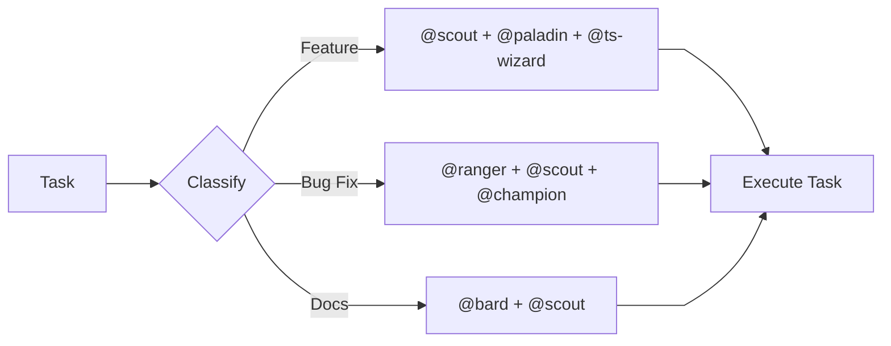

# Coding Party: A DnD Approach to Agentic Coding

> "Turning a chaotic swarm of assistants into a balanced adventuring party."

This repository contains a collection of AI coding agent personas modeled after
**Dungeons & Dragons** character classes. By assigning specific archetypes—with
defined abilities, alignments, and limitations—we can create a more effective,
collaborative, and balanced team of AI assistants.

## The Concept

After experimenting with AI coding agents, it became clear that vague prompts
like "You are a helpful assistant" often lead to "jack-of-all-trades,
master-of-none" results. Research suggests that **designed
incompetence**—deliberately limiting what an agent can do—actually helps them
excel at what they _should_ do.

When forming a party for a quest, agents fill different roles:

- **Champions** lead the quest as primary implementer
- **Vanguard** are the core party members essential for completion
- **Support** provides assistance and handles secondary concerns
- **Consultants** are called for specialized guidance (read-only by design)

## The Party Roster

### Champions (0-1)

_Leads the quest as primary implementer._

- **[`@warrior`](agent/warrior.md) (Spec Enforcer)**: Follows specifications to
  the letter. Leads feature implementation quests.
- **[`@paladin`](agent/paladin.md) (TDD Champion)**: Follows the sacred
  Red-Green-Refactor oath. Leads test-driven development quests.
- **[`@oracle`](agent/oracle.md) (Database Seer)**: Designs schemas and
  optimizes queries. Leads database-focused quests.
- **[`@berserker`](agent/berserker.md) (Debt Slayer)**: Aggressively eliminates
  technical debt and modernizes legacy code. Leads refactoring quests.

### Vanguard (1-3)

_Core party members essential for quest completion._

- **[`@scout`](agent/scout.md) (Swift Scout)**: Maps unknown territories and
  summarizes codebase structure.
- **[`@cleric`](agent/cleric.md) (Test Weaver)**: Creates and maintains test
  suites with Vitest.
- **[`@bard`](agent/bard.md) (Lore Keeper)**: Weaves documentation, narratives,
  and changelogs.
- **[`@warlock`](agent/warlock.md) (Contract Binder)**: Enforces API contracts
  through OpenAPI and GraphQL.
- **[`@tank`](agent/tank.md) (Iron Guardian)**: Implements error handling, fault
  tolerance, and graceful degradation.
- **[`@thief`](agent/thief.md) (Code Finder)**: Discovers implementations in the
  wild with proper attribution.

### Support (0-2)

_Provides assistance and handles secondary concerns._

- **[`@sage`](agent/sage.md) (Knowledge Seeker)**: Performs deep research and
  context gathering.
- **[`@scribe`](agent/scribe.md) (Git Keeper)**: Manages version control and
  semantic commits.
- **[`@alchemist`](agent/alchemist.md) (Performance Transmuter)**: Profiles and
  optimizes performance bottlenecks.
- **[`@armorer`](agent/armorer.md) (Release Smith)**: Manages CI/CD pipelines
  and deployment orchestration.
- **[`@champion`](agent/champion.md) (Code Defender)**: Reviews code for
  security vulnerabilities and quality.
- **[`@ranger`](agent/ranger.md) (Bug Hunter)**: Investigates issues and
  performs root cause analysis.
- **[`@rogue`](agent/rogue.md) (Spec Auditor)**: Detects inconsistencies and
  gaps in specifications.

### Consultants (0-2)

_Specialized guidance experts. Read-only by design—they advise but don't
implement._

- **[`@ts-wizard`](agent/ts-wizard.md) (Type Runesmith)**: TypeScript type
  system expert.
- **[`@react-wizard`](agent/react-wizard.md) (Component Mage)**: React patterns
  and hooks specialist.
- **[`@effect-wizard`](agent/effect-wizard.md) (Functional Archmage)**:
  Effect-TS and functional programming expert.
- **[`@tw-wizard`](agent/tw-wizard.md) (Utility Weaver)**: Tailwind CSS styling
  consultant.
- **[`@lit-wizard`](agent/lit-wizard.md) (Shadow DOM Smith)**: Web Components
  and Lit expert.
- **[`@artisan`](agent/artisan.md) (Style Crafter)**: CSS modernization and
  browser compatibility consultant.
- **[`@monk`](agent/monk.md) (State Keeper)**: State management patterns for
  Redux, Zustand, TanStack Query, and XState.
- **[`@shepherd`](agent/shepherd.md) (Accessibility Guardian)**: WCAG compliance
  and inclusive design guidance.

## Usage

This repository includes commands to help you manage your party.

### Forming a Party

Use the **[`/form-party`](command/form-party.md)** command to analyze a task and
assemble the perfect team. It implements a "routing workflow" to classify your
request (e.g., Feature, Bug Fix, Documentation) and assign the right
specialists.

### Hiring an Agent

Use **[`/hire-agent`](command/hire-agent.md)** to bring a specific persona into
your current context.

## Why This Works

1. **Memorable Identities**: `@paladin` is more evocative than "TDD Agent",
   making the persona's constraints feel natural rather than arbitrary.
2. **Clear Boundaries**: A "Wizard" consultant doesn't write code; a "Scout"
   doesn't modify files. This prevents context rot.
3. **Swarm Intelligence**: Specialized agents with clear roles outperform
   generalists by reducing the solution space and isolating failures.

---

> Inspired by the article
> "[Coding Party: A DnD Approach to Agentic Coding](https://www.lloydrichards.dev/labs/055-forming-the-party)"
